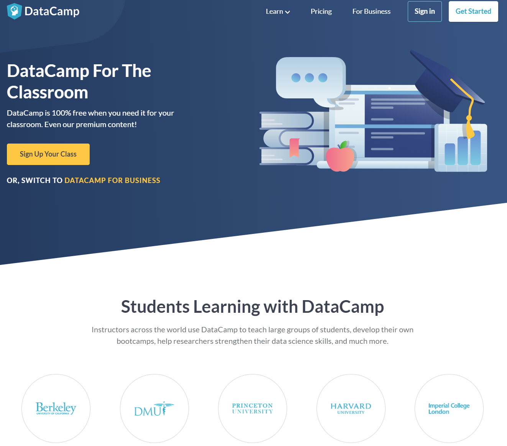
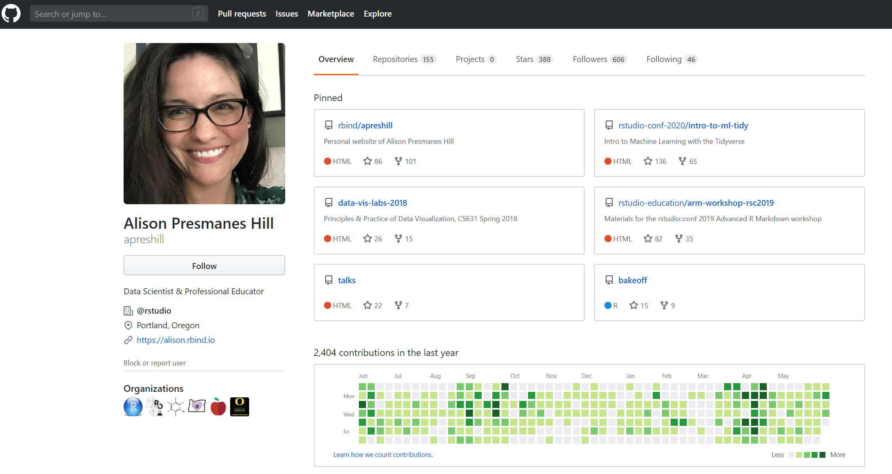
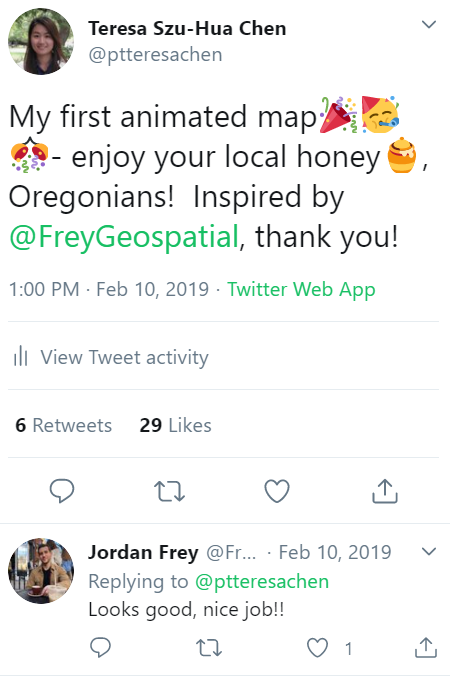
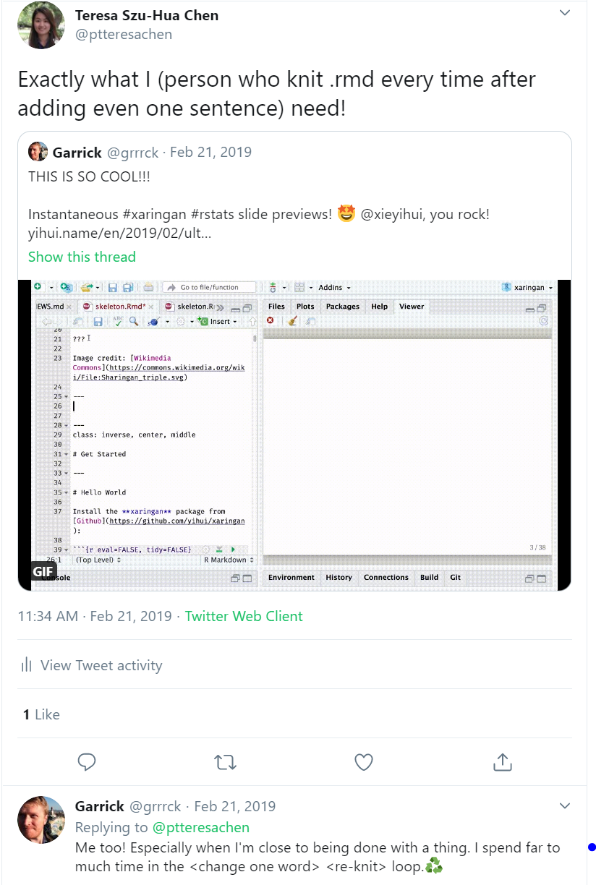
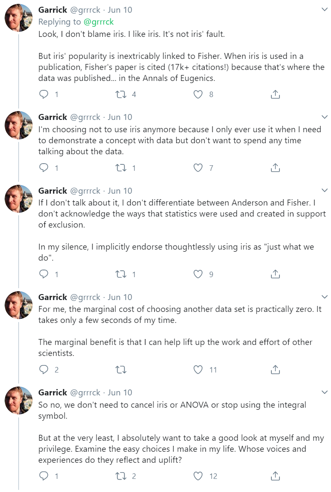

```{r setup, include=FALSE}
options(htmltools.dir.version = FALSE)
library(icon)
library(tidyverse)
library(palmerpenguins)
library(DT)
```

class: inverse, center, middle

# Find me at...


`r icon::fontawesome("paper-plane", style = "solid")`  teresa.sh.chen@gmail.com  
`r icon::fontawesome$brands$twitter` ptteresachen 
`r icon::fontawesome$brands$github` @teresashchen


---


background-image: url(https://media.giphy.com/media/XDYIuWmMqeEKmqEfEp/giphy.gif)
background-position: 50% 80%
background-size: 50%
class: center, inverse

# Get Started

---

background-image: url(https://www.arcgis.com/sharing/rest/content/items/83c6a3fc74464f7ea1aeb279ca2c9691/resources/1576110869922.jpeg?w=2630)
background-position: 50% 95%
background-size: 40%

# B95 | R99 | Work | 6000-miles Journey

.pull-left[

]

.pull-right[

]

.footnote[[link to CV](https://teresashchen.github.io/blog/cv.html)
]

---

background-image: url(https://tedideas.files.wordpress.com/2018/12/featured_art_DuncanDavidsonTED.jpg)
background-position: 50% 80%
background-size: cover
class: middle, inverse

# About the topic

--
### What have I learned in the past 4 years?  
 
--
### What do you want to hear from me?  
  
--
### What are things that I wish to facilitate in this talk?  
 
---
name: objectives
class: inverse, middle, center

# R/Rstudio is awesome in many different ways.

--
### It's an open source.  

--
### It helps you to explore data and generate plots.  

--
### It has many add-on capabilities, i.e. building website.  

--
### Its supporting communities are excellent and inclusive. 

--
### It plays an important role in moving RESEARCH forward.


---
background-image: url(https://www.3playmedia.com/wp-content/uploads/blackboard-collaborate-blog-header-1400x900.jpg)
background-size: cover

class: bottom, inverse, right
# It's an open source.

---
.left-column[ ### Software ]
.right-column[]

---
.left-column[ 
### Software
### Package]

.right-column[]

---
.left-column[ 
### Software
### Package
### Books]

.right-column[

```{r out.width = '30%', echo=FALSE}
# url
knitr::include_graphics("https://d33wubrfki0l68.cloudfront.net/19dafd10a53785f1407566a1f3a09b29a6bab847/1e5f0/images/logos/book_cover.png")

knitr::include_graphics("https://d33wubrfki0l68.cloudfront.net/b88ef926a004b0fce72b2526b0b5c4413666a4cb/24a30/cover.png")

knitr::include_graphics("https://rc2e.com/images_v2/book_cover.jpg")

knitr::include_graphics("https://images-na.ssl-images-amazon.com/images/I/5115ilJfAwL._SX379_BO1,204,203,200_.jpg")

knitr::include_graphics("https://bookdown.org/yihui/bookdown/images/cover.jpg")

knitr::include_graphics("https://bookdown.org/yihui/rmarkdown/images/cover.png")

```
]

---
.left-column[ 
### Software
### Package
### Books
### Online Learning]

.right-column[]
---

.left-column[ 
### Software
### Package
### Books
### Online Learning
### Shared Resources]

.right-column[]

.footnote[
[Allison's Github](https://github.com/apreshill)
]
---
class: inverse, bottom, right

background-image: url(https://altis.com.au/wp-content/uploads/2018/11/data_viz-1024x680.jpeg)
background-size: cover

# It helps you to </br>explore data & generate plots.  

--

## Excel + SPSS + Powerpoint

---

# Example Data

```{r table, echo = FALSE}

penguins %>% 
  select(species, culmen_length_mm, culmen_depth_mm, flipper_length_mm, body_mass_g) %>% 
  drop_na() %>% 
  kableExtra::kable(digits = 3) %>% 
  kableExtra::kable_styling(bootstrap_options = "striped", full_width = F) %>% 
  kableExtra::scroll_box(width = "800px", height = "500px")
```


---
.left-code[
```{r plot1, fig.show="hide", fig.retina = 3, warning=FALSE}

penguins %>% 
  ggplot(aes(x = culmen_length_mm, y = culmen_depth_mm, color = species, group = species)) +
  geom_point(aes(shape = species),
             size = 3, alpha = 0.8) +
  theme_minimal()
```
]

.right-plot[
`)
]


---
.left-code[
```{r plot2, fig.show="hide", fig.retina = 3, warning=FALSE}

penguins %>% 
  ggplot(aes(x = culmen_length_mm, y = culmen_depth_mm, color = species, group = species)) +
  geom_point(aes(shape = species),
             size = 3, alpha = 0.8) +
  geom_smooth(se = FALSE, method = "lm") +
  theme_minimal() +
  scale_color_manual(values = c("darkorange","purple","cyan4")) +
  labs(title = "Penguin culmen dimensions",
       subtitle = "Culmen length and depth for different penguins",
       x = "Culmen length (mm)",
       y = "Culmen depth (mm)",
       color = "Penguin species",
       shape = "Penguin species") +
  theme(legend.position = c(0.85, 0.15),
        legend.background = element_rect(fill = "white", color = NA),
        plot.caption = element_text(hjust = 0, face= "italic"))
```
]

.right-plot[
`)
]

.footnote[codes from [palmerpenguins](https://allisonhorst.github.io/palmerpenguins/articles/examples.html)

]

---
class: middle, center

# This is how I used R for my research.

## [example 1](file:///C:/Users/teres/OneDrive%20-%20University%20Of%20Oregon/Backup/_Teresa%20Chen/1_Dissertation/2_Analysis/2_WALK/walk_git/walk_tidy_stats.html)

## [example 2](https://pssstl.shinyapps.io/6_1_final_shiny)

## [example 3](https://teresashchen.github.io/blog/)


---
class: inverse, bottom, right

background-image: url(https://www.westcountrycheese.co.uk/images/promo/1/Home_Banners-Cheese_and_Pork_Pie_Cakes-0784.jpg)
background-size: cover

# It has many add-on capabilities, </br> i.e. building website, creating CV. 

---
class: middle, center

# Here are some examples:

## [CV](file:///C:/Users/teres/OneDrive%20-%20University%20Of%20Oregon/9_Sideproject/wang_cv/cv2.html)

## [website](https://ptpeiyuyang.netlify.app/)

--
## And these slides too!
---

class: inverse, bottom, center
background-image: url(https://media.giphy.com/media/3oxHQjBRCjvvlHmUHm/giphy.gif)
background-size: 50%

# Don't feel overwhelmed!

---
class: inverse, bottom, right

background-image: url(https://www.cscce.org/wp-content/uploads/2019/08/Go-CEFP-1024x768.jpg)
background-size: cover

# Its supporting communities are </br> excellent and inclusive. 

---
.pull-left[]
--
.pull-right[]


---
# Network of the R Community


---
class: inverse, bottom, right

background-image: url(https://miro.medium.com/max/3200/1*1B15QlNrMbLUDqu-90svuw.jpeg)
background-size: cover

# It plays an important role in </br> moving RESEARCH forward.

---


---

# R is more than just a tool.

--

.left-code[

## Black Lives Matter 

## Ronald Fisher (1890-1962)

## **Iris** dataset 

## Should we use it?
]


--
.right-plot[

```{r out.width = '70%', echo=FALSE}
# local

```
]

---

class: inverse, middle, center

## Open Sources  

--
## Research Tools  

--
## Add-on Functions  

--
## Supporting Communities  

--
## Social Responsibility

--


